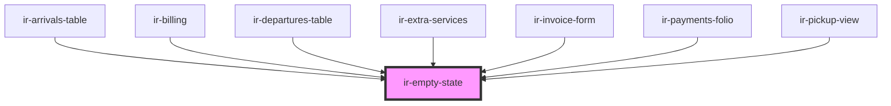

# ir-empty-state

<!-- Auto Generated Below -->

## Properties

| Property  | Attribute | Description | Type     | Default              |
| --------- | --------- | ----------- | -------- | -------------------- |
| `message` | `message` |             | `string` | `'No records found'` |

## Shadow Parts

| Part        | Description |
| ----------- | ----------- |
| `"message"` |             |

## Dependencies

### Used by

 - [ir-arrivals-table](../ir-arrivals/ir-arrivals-table)
 - [ir-billing](../ir-billing)
 - [ir-departures-table](../ir-departures/ir-departures-table)
 - [ir-extra-services](../ir-booking-details/ir-extra-services)
 - [ir-invoice-form](../ir-invoice/ir-invoice-form)
 - [ir-payments-folio](../ir-booking-details/ir-payment-details/ir-payments-folio)
 - [ir-pickup-view](../ir-booking-details/ir-pickup-view)

### Graph

----------------------------------------------

*Built with [StencilJS](https://stenciljs.com/)*
