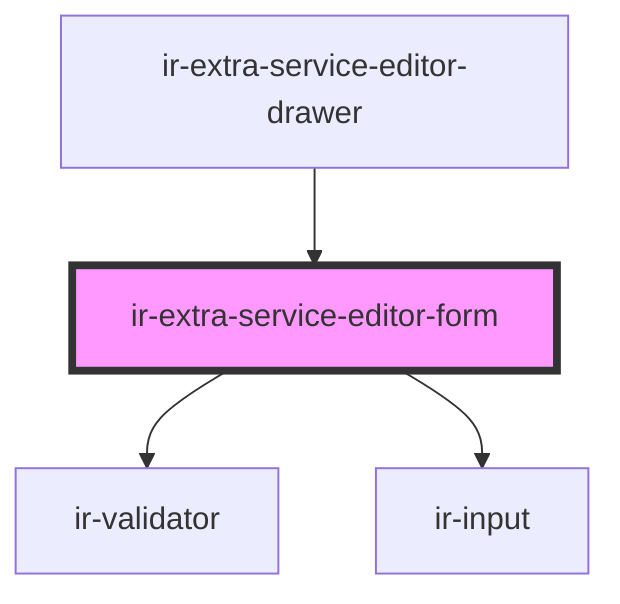

# ir-extra-service-editor-form

<!-- Auto Generated Below -->

## Properties

| Property  | Attribute | Description | Type                                                                                                                                                                                                                                                                                                                      | Default     |
| --------- | --------- | ----------- | ------------------------------------------------------------------------------------------------------------------------------------------------------------------------------------------------------------------------------------------------------------------------------------------------------------------------- | ----------- |
| `formId`  | `form-id` |             | `string`                                                                                                                                                                                                                                                                                                                  | `undefined` |
| `service` | --        |             | `{ name?: string; id?: number; property_id?: number; code?: string; is_active?: boolean; section?: "accommodation" \| "addon"; default_price?: number; vat_mode?: "001" \| "000"; allow_price_override?: boolean; day_use_config?: { block_night?: boolean; default_start_time?: string; default_end_time?: string; }; }` | `undefined` |

## Events

| Event                | Description | Type                                                                                                                                                                                                                                                                                                                                   |
| -------------------- | ----------- | -------------------------------------------------------------------------------------------------------------------------------------------------------------------------------------------------------------------------------------------------------------------------------------------------------------------------------------- |
| `closeDrawer`        |             | `CustomEvent<void>`                                                                                                                                                                                                                                                                                                                    |
| `loadingChanged`     |             | `CustomEvent<boolean>`                                                                                                                                                                                                                                                                                                                 |
| `upsertExtraService` |             | `CustomEvent<{ name?: string; id?: number; property_id?: number; code?: string; is_active?: boolean; section?: "accommodation" \| "addon"; default_price?: number; vat_mode?: "001" \| "000"; allow_price_override?: boolean; day_use_config?: { block_night?: boolean; default_start_time?: string; default_end_time?: string; }; }>` |

## Dependencies

### Used by

 - [ir-extra-service-editor-drawer](..)

### Depends on

- [ir-validator](../../../ui/ir-validator)
- [ir-input](../../../ui/ir-input)

### Graph

----------------------------------------------

*Built with [StencilJS](https://stenciljs.com/)*
