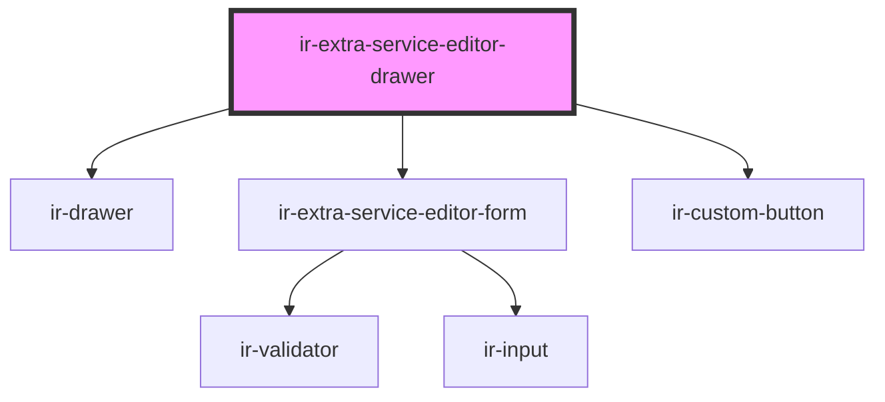

# ir-extra-service-editor-drawer

<!-- Auto Generated Below -->

## Properties

| Property  | Attribute | Description | Type                                                                                                                                                                                                                                                                                                                      | Default     |
| --------- | --------- | ----------- | ------------------------------------------------------------------------------------------------------------------------------------------------------------------------------------------------------------------------------------------------------------------------------------------------------------------------- | ----------- |
| `open`    | `open`    |             | `boolean`                                                                                                                                                                                                                                                                                                                 | `false`     |
| `service` | --        |             | `{ name?: string; id?: number; property_id?: number; code?: string; is_active?: boolean; section?: "accommodation" \| "addon"; default_price?: number; vat_mode?: "001" \| "000"; allow_price_override?: boolean; day_use_config?: { block_night?: boolean; default_start_time?: string; default_end_time?: string; }; }` | `undefined` |

## Events

| Event                     | Description | Type                |
| ------------------------- | ----------- | ------------------- |
| `extraServiceEditorClose` |             | `CustomEvent<void>` |

## Dependencies

### Depends on

- [ir-drawer](../../ir-drawer)
- [ir-extra-service-editor-form](ir-extra-service-editor-form)
- [ir-custom-button](../../ui/ir-custom-button)

### Graph

----------------------------------------------

*Built with [StencilJS](https://stenciljs.com/)*
