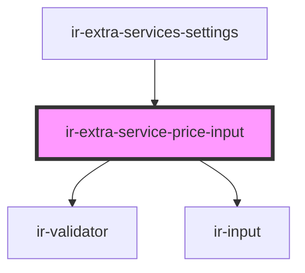

# ir-extra-service-price-input

<!-- Auto Generated Below -->

## Properties

| Property       | Attribute       | Description                                                                                                                              | Type                                 | Default     |
| -------------- | --------------- | ---------------------------------------------------------------------------------------------------------------------------------------- | ------------------------------------ | ----------- |
| `autoValidate` | `auto-validate` |                                                                                                                                          | `boolean`                            | `undefined` |
| `chargeRule`   | --              | Controlled charge rule value passed from the parent: `value` holds the price, `mode` holds the taxation mode code (Inclusive/Exclusive). | `{ value?: number; mode?: string; }` | `undefined` |
| `label`        | `label`         |                                                                                                                                          | `string`                             | `undefined` |
| `placeholder`  | `placeholder`   |                                                                                                                                          | `string`                             | `undefined` |

## Events

| Event         | Description | Type                                              |
| ------------- | ----------- | ------------------------------------------------- |
| `priceChange` |             | `CustomEvent<{ value?: number; mode?: string; }>` |

## Shadow Parts

| Part      | Description |
| --------- | ----------- |
| `"input"` |             |

## Dependencies

### Used by

 - [ir-extra-services-settings](..)

### Depends on

- [ir-validator](../../ui/ir-validator)
- [ir-input](../../ui/ir-input)

### Graph

----------------------------------------------

*Built with [StencilJS](https://stenciljs.com/)*
