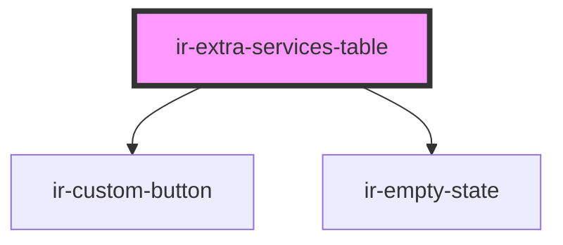

# ir-extra-services-table

<!-- Auto Generated Below -->

## Properties

| Property     | Attribute     | Description | Type                                                                                                                                                                                                                                                                                                                        | Default     |
| ------------ | ------------- | ----------- | --------------------------------------------------------------------------------------------------------------------------------------------------------------------------------------------------------------------------------------------------------------------------------------------------------------------------- | ----------- |
| `propertyId` | `property-id` |             | `number`                                                                                                                                                                                                                                                                                                                    | `undefined` |
| `section`    | `section`     |             | `"accommodation" \| "addon"`                                                                                                                                                                                                                                                                                                | `undefined` |
| `services`   | --            |             | `{ name?: string; id?: number; property_id?: number; code?: string; is_active?: boolean; section?: "accommodation" \| "addon"; default_price?: number; vat_mode?: "001" \| "000"; allow_price_override?: boolean; day_use_config?: { block_night?: boolean; default_start_time?: string; default_end_time?: string; }; }[]` | `[]`        |

## Events

| Event                      | Description | Type                                                                                                                                                                                                                                                                                                                                   |
| -------------------------- | ----------- | -------------------------------------------------------------------------------------------------------------------------------------------------------------------------------------------------------------------------------------------------------------------------------------------------------------------------------------- |
| `toggleExtraServiceActive` |             | `CustomEvent<{ name?: string; id?: number; property_id?: number; code?: string; is_active?: boolean; section?: "accommodation" \| "addon"; default_price?: number; vat_mode?: "001" \| "000"; allow_price_override?: boolean; day_use_config?: { block_night?: boolean; default_start_time?: string; default_end_time?: string; }; }>` |
| `upsertExtraService`       |             | `CustomEvent<{ name?: string; id?: number; property_id?: number; code?: string; is_active?: boolean; section?: "accommodation" \| "addon"; default_price?: number; vat_mode?: "001" \| "000"; allow_price_override?: boolean; day_use_config?: { block_night?: boolean; default_start_time?: string; default_end_time?: string; }; }>` |

## Dependencies

### Depends on

- [ir-custom-button](../../ui/ir-custom-button)
- [ir-empty-state](../../ir-empty-state)

### Graph

----------------------------------------------

*Built with [StencilJS](https://stenciljs.com/)*
