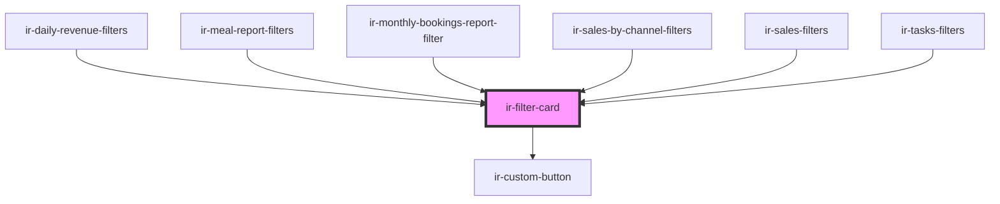

# ir-filter-card

<!-- Auto Generated Below -->

## Shadow Parts

| Part            | Description |
| --------------- | ----------- |
| `"filter-body"` |             |
| `"footer"`      |             |
| `"header"`      |             |

## Dependencies

### Used by

 - [ir-daily-revenue-filters](../ir-daily-revenue/ir-daily-revenue-filters)
 - [ir-meal-report-filters](../ir-meal-report/ir-meal-report-filters)
 - [ir-monthly-bookings-report-filter](../ir-monthly-bookings-report/ir-monthly-bookings-report-filter)
 - [ir-sales-by-channel-filters](../ir-sales-by-channel/ir-sales-by-channel-filters)
 - [ir-sales-filters](../ir-sales-by-country/ir-sales-filters)
 - [ir-tasks-filters](../ir-housekeeping/ir-hk-tasks/ir-tasks-filters)

### Depends on

- [ir-custom-button](../ui/ir-custom-button)

### Graph

----------------------------------------------

*Built with [StencilJS](https://stenciljs.com/)*
