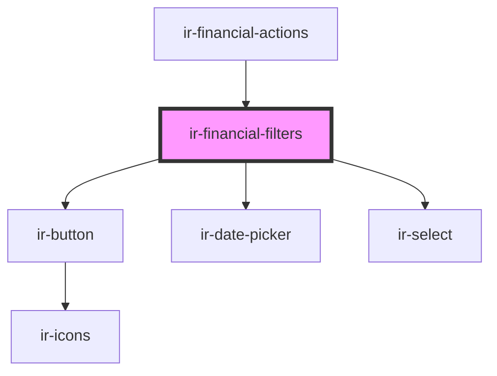

# ir-financial-filters

<!-- Auto Generated Below -->

## Properties

| Property    | Attribute    | Description | Type      | Default     |
| ----------- | ------------ | ----------- | --------- | ----------- |
| `isLoading` | `is-loading` |             | `boolean` | `undefined` |

## Events

| Event             | Description | Type                                                 |
| ----------------- | ----------- | ---------------------------------------------------- |
| `fetchNewReports` |             | `CustomEvent<{ date: string; sourceCode: string; }>` |

## Dependencies

### Used by

 - [ir-financial-actions](..)

### Depends on

- [ir-button](../../ui/ir-button)
- [ir-date-picker](../../ui/ir-date-picker)
- [ir-select](../../ui/ir-select)

### Graph

----------------------------------------------

*Built with [StencilJS](https://stenciljs.com/)*
