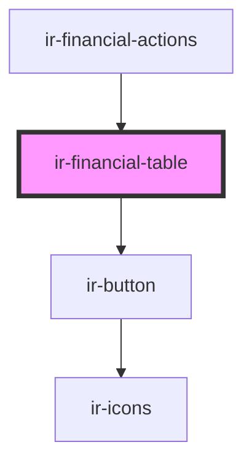

# ir-financial-table

<!-- Auto Generated Below -->

## Events

| Event                         | Description | Type                                                                                                                                                    |
| ----------------------------- | ----------- | ------------------------------------------------------------------------------------------------------------------------------------------------------- |
| `financialActionsOpenSidebar` |             | `CustomEvent<{ type: "booking"; payload: { bookingNumber: number; }; } \| { type: "payment"; payload: { payment: Payment; bookingNumber: number; }; }>` |

## Dependencies

### Used by

 - [ir-financial-actions](..)

### Depends on

- [ir-button](../../ui/ir-button)

### Graph

----------------------------------------------

*Built with [StencilJS](https://stenciljs.com/)*
