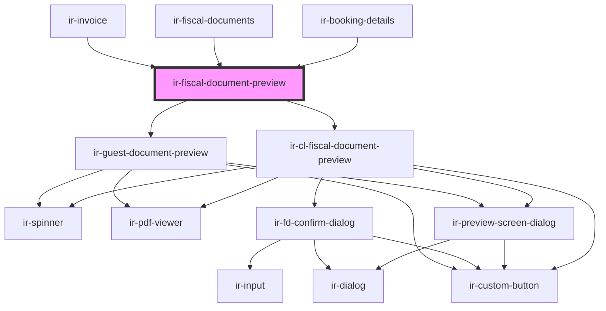

# ir-fiscal-document-preview

<!-- Auto Generated Below -->

## Overview

Fiscal Document Preview

Thin wrapper that mounts the appropriate preview component(s). Both inner
previews are passive, window-event-driven listeners, so the host just needs
to render this once. `documentConverted` from the agent preview bubbles
through to the host.

## Properties

| Property     | Attribute     | Description                                                     | Type                          | Default     |
| ------------ | ------------- | --------------------------------------------------------------- | ----------------------------- | ----------- |
| `mode`       | `mode`        | Which preview flows to enable. Defaults to agent (city-ledger). | `"agent" \| "all" \| "guest"` | `'agent'`   |
| `propertyId` | `property-id` |                                                                 | `number`                      | `undefined` |
| `ticket`     | `ticket`      |                                                                 | `string`                      | `undefined` |

## Events

| Event               | Description                                                         | Type                |
| ------------------- | ------------------------------------------------------------------- | ------------------- |
| `documentConverted` | Re-emitted when the agent preview converts a draft into an invoice. | `CustomEvent<void>` |

## Dependencies

### Used by

 - [ir-booking-details](../../ir-booking-details)
 - [ir-fiscal-documents](..)
 - [ir-invoice](../../ir-invoice)

### Depends on

- [ir-cl-fiscal-document-preview](../../ir-city-ledger/ir-city-ledger-fiscal-documents/ir-cl-fiscal-document-preview)
- [ir-guest-document-preview](../ir-guest-document-preview)

### Graph

----------------------------------------------

*Built with [StencilJS](https://stenciljs.com/)*
