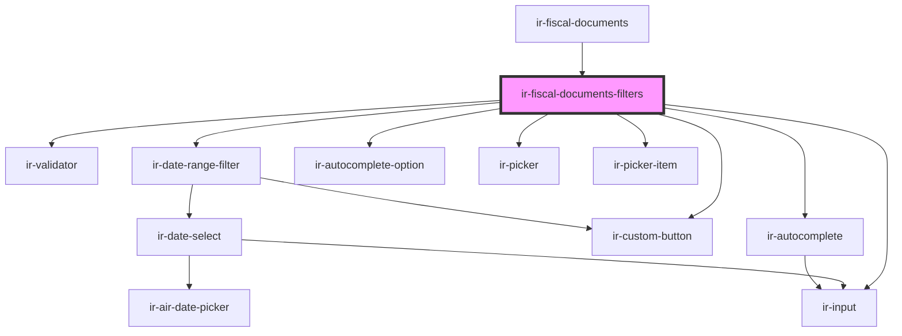

# ir-fiscal-documents-filters

<!-- Auto Generated Below -->

## Properties

| Property     | Attribute     | Description | Type                    | Default                                                                                                                                                                                                  |
| ------------ | ------------- | ----------- | ----------------------- | -------------------------------------------------------------------------------------------------------------------------------------------------------------------------------------------------------- |
| `filters`    | --            |             | `FiscalDocumentFilters` | `{     fromDate: undefined,     toDate: undefined,     docNumber: '',     taxableOnly: false,     type: 'all',     proformaOnly: false,     folioType: 'all',     agentId: null,     guestId: null,   }` |
| `propertyId` | `property-id` |             | `number`                | `undefined`                                                                                                                                                                                              |

## Events

| Event           | Description | Type                                 |
| --------------- | ----------- | ------------------------------------ |
| `applyFilters`  |             | `CustomEvent<FiscalDocumentFilters>` |
| `filtersChange` |             | `CustomEvent<FiscalDocumentFilters>` |

## Dependencies

### Used by

 - [ir-fiscal-documents](..)

### Depends on

- [ir-validator](../../ui/ir-validator)
- [ir-date-range-filter](../../ui/ir-date-range-filter)
- [ir-autocomplete](../../ui/ir-autocomplete)
- [ir-autocomplete-option](../../ui/ir-autocomplete/ir-autocomplete-option)
- [ir-picker](../../ui/ir-picker)
- [ir-picker-item](../../ui/ir-picker/ir-picker-item)
- [ir-input](../../ui/ir-input)
- [ir-custom-button](../../ui/ir-custom-button)

### Graph

----------------------------------------------

*Built with [StencilJS](https://stenciljs.com/)*
