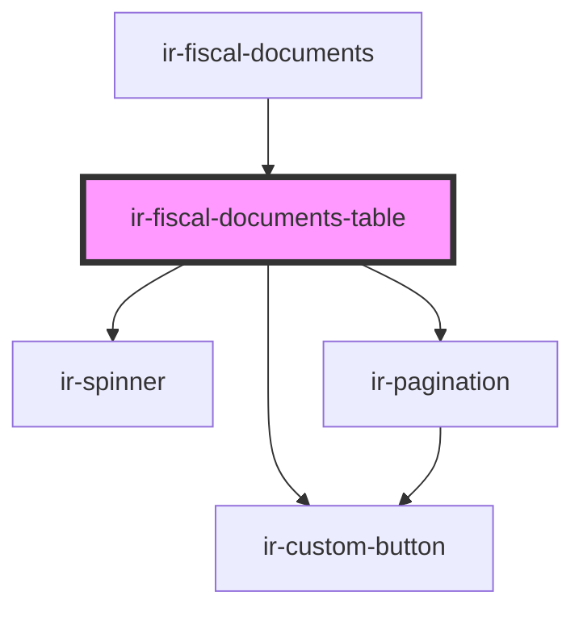

# ir-fiscal-documents-table

<!-- Auto Generated Below -->

## Properties

| Property       | Attribute       | Description                                                                | Type                                                                                                                                                                                                                                                                                                                                                                                                                     | Default         |
| -------------- | --------------- | -------------------------------------------------------------------------- | ------------------------------------------------------------------------------------------------------------------------------------------------------------------------------------------------------------------------------------------------------------------------------------------------------------------------------------------------------------------------------------------------------------------------ | --------------- |
| `agentId`      | `agent-id`      | Selected agent id (when a specific agent is chosen under the agent folio). | `number`                                                                                                                                                                                                                                                                                                                                                                                                                 | `null`          |
| `currencies`   | --              |                                                                            | `ICurrency[]`                                                                                                                                                                                                                                                                                                                                                                                                            | `[]`            |
| `currentPage`  | `current-page`  |                                                                            | `number`                                                                                                                                                                                                                                                                                                                                                                                                                 | `1`             |
| `fdTypes`      | --              | `_FD_TYPE` setup entries used to display the document type.                | `IEntries[]`                                                                                                                                                                                                                                                                                                                                                                                                             | `[]`            |
| `folioType`    | `folio-type`    | Folio scope driving which identity columns are shown.                      | `"agent" \| "all" \| "guest"`                                                                                                                                                                                                                                                                                                                                                                                            | `'all'`         |
| `fromDate`     | `from-date`     |                                                                            | `string`                                                                                                                                                                                                                                                                                                                                                                                                                 | `null`          |
| `guestId`      | `guest-id`      | Selected guest id (when a specific guest is chosen under the guest folio). | `number`                                                                                                                                                                                                                                                                                                                                                                                                                 | `null`          |
| `hasDates`     | `has-dates`     |                                                                            | `boolean`                                                                                                                                                                                                                                                                                                                                                                                                                | `false`         |
| `hasFetched`   | `has-fetched`   |                                                                            | `boolean`                                                                                                                                                                                                                                                                                                                                                                                                                | `false`         |
| `isLoading`    | `is-loading`    |                                                                            | `boolean`                                                                                                                                                                                                                                                                                                                                                                                                                | `false`         |
| `language`     | `language`      |                                                                            | `string`                                                                                                                                                                                                                                                                                                                                                                                                                 | `'en'`          |
| `pageSize`     | `page-size`     |                                                                            | `number`                                                                                                                                                                                                                                                                                                                                                                                                                 | `20`            |
| `pageSizes`    | --              |                                                                            | `number[]`                                                                                                                                                                                                                                                                                                                                                                                                               | `[20, 50, 100]` |
| `propertyId`   | `property-id`   |                                                                            | `number`                                                                                                                                                                                                                                                                                                                                                                                                                 | `undefined`     |
| `rows`         | --              |                                                                            | `{ TARGET_TYPE?: "AGENT" \| "GUEST"; AGENT_ID?: number; AGENT_NAME?: string; GUEST_ID?: number; GUEST_NAME?: string; GUEST_EMAIL?: string; BOOKING_ID?: number; BOOKING_NUMBER?: string; DOC_ID?: number; DOC_NUMBER?: string; DOC_DATE?: string; DOC_TYPE?: string; FD_TYPE_CODE?: string; CURRENCY_ID?: number; TOTAL_AMOUNT?: number; CREDIT?: number; DEBIT?: number; NET_AMOUNT?: number; TAX_AMOUNT?: number; }[]` | `[]`            |
| `taxableOnly`  | `taxable-only`  |                                                                            | `boolean`                                                                                                                                                                                                                                                                                                                                                                                                                | `false`         |
| `ticket`       | `ticket`        |                                                                            | `string`                                                                                                                                                                                                                                                                                                                                                                                                                 | `undefined`     |
| `toDate`       | `to-date`       |                                                                            | `string`                                                                                                                                                                                                                                                                                                                                                                                                                 | `null`          |
| `totalRecords` | `total-records` |                                                                            | `number`                                                                                                                                                                                                                                                                                                                                                                                                                 | `0`             |

## Events

| Event                     | Description                                                                                 | Type                                          |
| ------------------------- | ------------------------------------------------------------------------------------------- | --------------------------------------------- |
| `clFiscalDocumentPreview` |                                                                                             | `CustomEvent<ClFiscalDocumentPreviewRequest>` |
| `fetchRequested`          |                                                                                             | `CustomEvent<void>`                           |
| `guestDocumentPreview`    | Emitted when a guest document link/action is clicked (caught by ir-guest-document-preview). | `CustomEvent<GuestDocumentPreviewRequest>`    |
| `openBookingDetails`      | Emitted with the booking number when a booking link is clicked.                             | `CustomEvent<string>`                         |
| `requestPageChange`       |                                                                                             | `CustomEvent<PaginationChangeEvent>`          |
| `requestPageSizeChange`   |                                                                                             | `CustomEvent<PaginationChangeEvent>`          |

## Dependencies

### Used by

 - [ir-fiscal-documents](..)

### Depends on

- [ir-custom-button](../../ui/ir-custom-button)
- [ir-spinner](../../ui/ir-spinner)
- [ir-pagination](../../ir-pagination)

### Graph

----------------------------------------------

*Built with [StencilJS](https://stenciljs.com/)*
