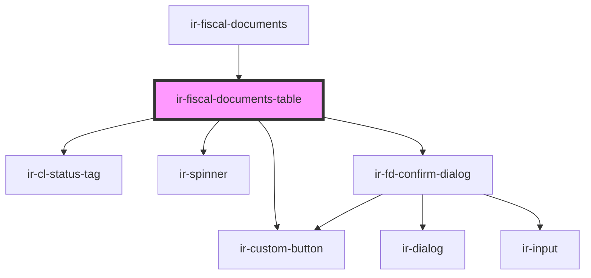

# ir-fiscal-documents-table

<!-- Auto Generated Below -->

## Properties

| Property         | Attribute         | Description                                                                | Type                          | Default     |
| ---------------- | ----------------- | -------------------------------------------------------------------------- | ----------------------------- | ----------- |
| `agentId`        | `agent-id`        | Selected agent id (when a specific agent is chosen under the agent folio). | `number`                      | `null`      |
| `currencies`     | --                |                                                                            | `ICurrency[]`                 | `[]`        |
| `currencySymbol` | `currency-symbol` |                                                                            | `string`                      | `'$'`       |
| `folioType`      | `folio-type`      | Folio scope driving which identity columns are shown.                      | `"agent" \| "all" \| "guest"` | `'all'`     |
| `fromDate`       | `from-date`       |                                                                            | `string`                      | `null`      |
| `guestId`        | `guest-id`        | Selected guest id (when a specific guest is chosen under the guest folio). | `number`                      | `null`      |
| `hasDates`       | `has-dates`       |                                                                            | `boolean`                     | `false`     |
| `hasFetched`     | `has-fetched`     |                                                                            | `boolean`                     | `false`     |
| `isLoading`      | `is-loading`      |                                                                            | `boolean`                     | `false`     |
| `propertyId`     | `property-id`     |                                                                            | `number`                      | `undefined` |
| `rows`           | --                |                                                                            | `FiscalDocumentRow[]`         | `[]`        |
| `taxableOnly`    | `taxable-only`    |                                                                            | `boolean`                     | `false`     |
| `ticket`         | `ticket`          |                                                                            | `string`                      | `undefined` |
| `toDate`         | `to-date`         |                                                                            | `string`                      | `null`      |

## Events

| Event                     | Description | Type                                          |
| ------------------------- | ----------- | --------------------------------------------- |
| `clFiscalDocumentPreview` |             | `CustomEvent<ClFiscalDocumentPreviewRequest>` |
| `fetchRequested`          |             | `CustomEvent<void>`                           |

## Dependencies

### Used by

 - [ir-fiscal-documents](..)

### Depends on

- [ir-cl-status-tag](../../ir-city-ledger/ir-cl-status-tag)
- [ir-custom-button](../../ui/ir-custom-button)
- [ir-spinner](../../ui/ir-spinner)
- [ir-fd-confirm-dialog](../../ir-city-ledger/ir-city-ledger-fiscal-documents/ir-city-ledger-fiscal-documents-table/ir-fd-confirm-dialog)

### Graph

----------------------------------------------

*Built with [StencilJS](https://stenciljs.com/)*
