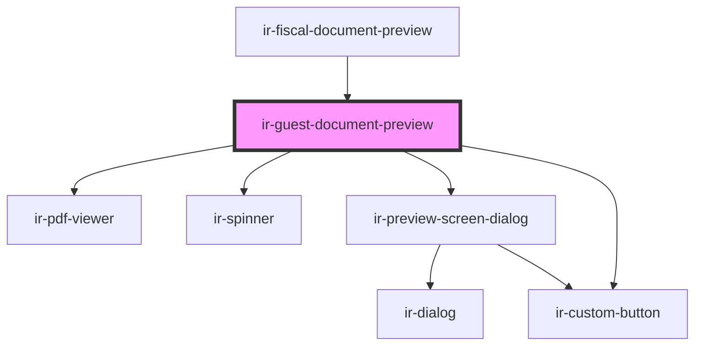

# ir-guest-document-preview

<!-- Auto Generated Below -->

## Overview

Guest Fiscal Document Preview

Self-contained, window-event-driven preview for guest documents — the guest
counterpart to `ir-cl-fiscal-document-preview`. It listens for
`guestDocumentPreview`, fetches the invoice / credit-note PDF via
`BookingService.printInvoice`, and renders it in a preview dialog
(same flow as `ir-guest-billing`).

## Properties

| Property     | Attribute     | Description | Type     | Default     |
| ------------ | ------------- | ----------- | -------- | ----------- |
| `propertyId` | `property-id` |             | `number` | `undefined` |
| `ticket`     | `ticket`      |             | `string` | `undefined` |

## Dependencies

### Used by

 - [ir-fiscal-document-preview](../ir-fiscal-document-preview)

### Depends on

- [ir-pdf-viewer](../../ir-pdf-viewer)
- [ir-spinner](../../ui/ir-spinner)
- [ir-preview-screen-dialog](../../ir-preview-screen-dialog)
- [ir-custom-button](../../ui/ir-custom-button)

### Graph

----------------------------------------------

*Built with [StencilJS](https://stenciljs.com/)*
