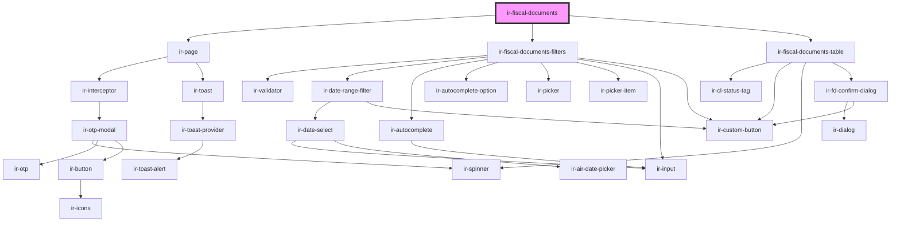

# ir-fiscal-documents

<!-- Auto Generated Below -->

## Properties

| Property     | Attribute    | Description | Type     | Default     |
| ------------ | ------------ | ----------- | -------- | ----------- |
| `baseurl`    | `baseurl`    |             | `string` | `undefined` |
| `language`   | `language`   |             | `string` | `'en'`      |
| `propertyid` | `propertyid` |             | `number` | `undefined` |
| `ticket`     | `ticket`     |             | `string` | `undefined` |

## Dependencies

### Depends on

- [ir-page](../ui/ir-page)
- [ir-fiscal-documents-filters](ir-fiscal-documents-filters)
- [ir-fiscal-documents-table](ir-fiscal-documents-table)

### Graph

----------------------------------------------

*Built with [StencilJS](https://stenciljs.com/)*
