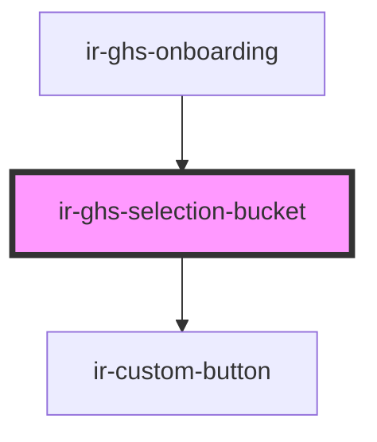

# ir-ghs-selection-bucket

<!-- Auto Generated Below -->

## Properties

| Property             | Attribute       | Description | Type                                                                                         | Default |
| -------------------- | --------------- | ----------- | -------------------------------------------------------------------------------------------- | ------- |
| `isGenerating`       | `is-generating` |             | `boolean`                                                                                    | `false` |
| `selectedProperties` | --              |             | `{ AC_ID?: number; NAME?: string; aname?: string; level2?: string; COUNTRY_ID?: number; }[]` | `[]`    |

## Events

| Event             | Description | Type                  |
| ----------------- | ----------- | --------------------- |
| `generateRequest` |             | `CustomEvent<void>`   |
| `removeAll`       |             | `CustomEvent<void>`   |
| `removeProperty`  |             | `CustomEvent<number>` |

## Dependencies

### Used by

 - [ir-ghs-onboarding](.)

### Depends on

- [ir-custom-button](../ui/ir-custom-button)

### Graph

----------------------------------------------

*Built with [StencilJS](https://stenciljs.com/)*
