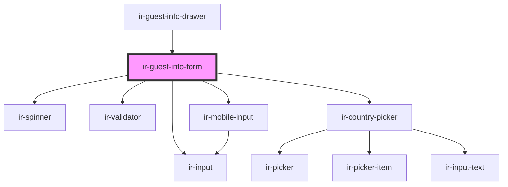

# ir-guest-info-form

<!-- Auto Generated Below -->

## Properties

| Property      | Attribute     | Description | Type     | Default     |
| ------------- | ------------- | ----------- | -------- | ----------- |
| `booking_nbr` | `booking_nbr` |             | `string` | `undefined` |
| `email`       | `email`       |             | `string` | `undefined` |
| `fromId`      | `from-id`     |             | `string` | `undefined` |
| `language`    | `language`    |             | `string` | `undefined` |
| `ticket`      | `ticket`      |             | `string` | `undefined` |

## Events

| Event                   | Description | Type                                                                                                                                                                                                                                                                                                                                                                                                                       |
| ----------------------- | ----------- | -------------------------------------------------------------------------------------------------------------------------------------------------------------------------------------------------------------------------------------------------------------------------------------------------------------------------------------------------------------------------------------------------------------------------- |
| `guestChanged`          |             | `CustomEvent<{ company_name?: string; company_tax_nbr?: string; address?: string; city?: string; country_id?: number; dob?: string; email?: string; first_name?: string; id?: number; last_name?: string; mobile?: string; country_phone_prefix?: string; subscribe_to_news_letter?: boolean; cci?: ICCI; alternative_email?: string; nbr_confirmed_bookings?: number; notes?: string; mobile_without_prefix?: string; }>` |
| `guestInfoDrawerClosed` |             | `CustomEvent<{ source: Element; }>`                                                                                                                                                                                                                                                                                                                                                                                        |
| `resetBookingEvt`       |             | `CustomEvent<null>`                                                                                                                                                                                                                                                                                                                                                                                                        |
| `toast`                 |             | `CustomEvent<ICustomToast & Partial<IToastWithButton> \| IDefaultToast & Partial<IToastWithButton>>`                                                                                                                                                                                                                                                                                                                       |

## Dependencies

### Used by

 - [ir-guest-info-drawer](../ir-guest-info-drawer)

### Depends on

- [ir-spinner](../../ui/ir-spinner)
- [ir-validator](../../ui/ir-validator)
- [ir-input](../../ui/ir-input)
- [ir-country-picker](../../ui/ir-country-picker)
- [ir-mobile-input](../../ui/ir-mobile-input)

### Graph

----------------------------------------------

*Built with [StencilJS](https://stenciljs.com/)*
