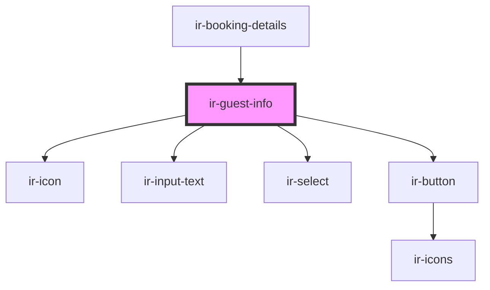

# ir-guest-info

<!-- Auto Generated Below -->

## Properties

| Property                 | Attribute     | Description | Type             | Default     |
| ------------------------ | ------------- | ----------- | ---------------- | ----------- |
| `booking_nbr`            | `booking_nbr` |             | `string`         | `undefined` |
| `defaultTexts`           | --            |             | `ILocale`        | `undefined` |
| `email`                  | `email`       |             | `string`         | `undefined` |
| `language`               | `language`    |             | `string`         | `undefined` |
| `setupDataCountries`     | --            |             | `selectOption[]` | `null`      |
| `setupDataCountriesCode` | --            |             | `selectOption[]` | `null`      |

## Events

| Event              | Description | Type                |
| ------------------ | ----------- | ------------------- |
| `closeSideBar`     |             | `CustomEvent<null>` |
| `resetBookingData` |             | `CustomEvent<null>` |

## Dependencies

### Used by

 - [ir-booking-details](../ir-booking-details)

### Depends on

- [ir-icon](../ir-icon)
- [ir-input-text](../ir-input-text)
- [ir-select](../ir-select)
- [ir-button](../ir-button)

### Graph

----------------------------------------------

*Built with [StencilJS](https://stenciljs.com/)*
