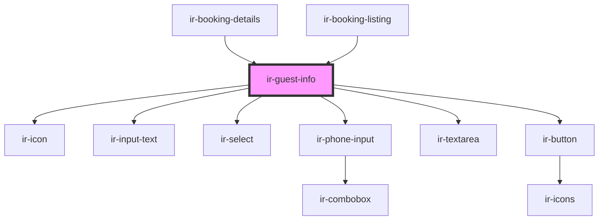

# ir-guest-info

<!-- Auto Generated Below -->

## Properties

| Property      | Attribute      | Description | Type      | Default     |
| ------------- | -------------- | ----------- | --------- | ----------- |
| `booking_nbr` | `booking_nbr`  |             | `string`  | `undefined` |
| `email`       | `email`        |             | `string`  | `undefined` |
| `headerShown` | `header-shown` |             | `boolean` | `undefined` |
| `language`    | `language`     |             | `string`  | `undefined` |
| `ticket`      | `ticket`       |             | `string`  | `undefined` |

## Events

| Event             | Description | Type                |
| ----------------- | ----------- | ------------------- |
| `closeSideBar`    |             | `CustomEvent<null>` |
| `resetBookingEvt` |             | `CustomEvent<null>` |

## Dependencies

### Used by

 - [ir-booking-details](../ir-booking-details)
 - [ir-booking-listing](../ir-booking-listing)

### Depends on

- [ir-icon](../ui/ir-icon)
- [ir-input-text](../ui/ir-input-text)
- [ir-select](../ui/ir-select)
- [ir-phone-input](../ui/ir-phone-input)
- [ir-textarea](../ui/ir-textarea)
- [ir-button](../ui/ir-button)

### Graph

----------------------------------------------

*Built with [StencilJS](https://stenciljs.com/)*
