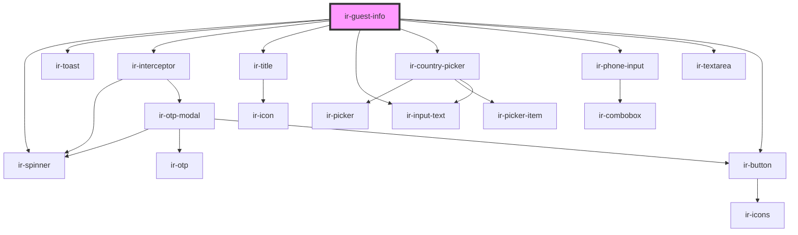

# ir-guest-info

<!-- Auto Generated Below -->

## Properties

| Property      | Attribute        | Description | Type      | Default     |
| ------------- | ---------------- | ----------- | --------- | ----------- |
| `booking_nbr` | `booking_nbr`    |             | `string`  | `undefined` |
| `email`       | `email`          |             | `string`  | `undefined` |
| `headerShown` | `header-shown`   |             | `boolean` | `undefined` |
| `isInSideBar` | `is-in-side-bar` |             | `boolean` | `undefined` |
| `language`    | `language`       |             | `string`  | `undefined` |
| `ticket`      | `ticket`         |             | `string`  | `undefined` |

## Events

| Event             | Description | Type                                                                                                 |
| ----------------- | ----------- | ---------------------------------------------------------------------------------------------------- |
| `closeSideBar`    |             | `CustomEvent<null>`                                                                                  |
| `resetBookingEvt` |             | `CustomEvent<null>`                                                                                  |
| `toast`           |             | `CustomEvent<ICustomToast & Partial<IToastWithButton> \| IDefaultToast & Partial<IToastWithButton>>` |

## Dependencies

### Depends on

- [ir-spinner](../ui/ir-spinner)
- [ir-toast](../ui/ir-toast)
- [ir-interceptor](../ir-interceptor)
- [ir-title](../ir-title)
- [ir-input-text](../ui/ir-input-text)
- [ir-country-picker](../ui/ir-country-picker)
- [ir-phone-input](../ui/ir-phone-input)
- [ir-textarea](../ui/ir-textarea)
- [ir-button](../ui/ir-button)

### Graph

----------------------------------------------

*Built with [StencilJS](https://stenciljs.com/)*
