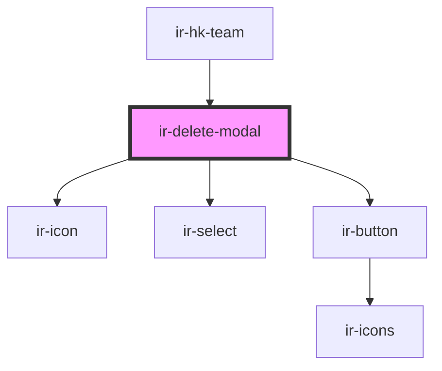

# ir-delete-modal

<!-- Auto Generated Below -->

## Properties

| Property | Attribute | Description | Type            | Default     |
| -------- | --------- | ----------- | --------------- | ----------- |
| `user`   | --        |             | `IHouseKeepers` | `undefined` |

## Events

| Event         | Description | Type                  |
| ------------- | ----------- | --------------------- |
| `modalClosed` |             | `CustomEvent<null>`   |
| `resetData`   |             | `CustomEvent<string>` |

## Methods

### `closeModal() => Promise<void>`

#### Returns

Type: `Promise<void>`

### `openModal() => Promise<void>`

#### Returns

Type: `Promise<void>`

## Dependencies

### Used by

 - [ir-hk-team](../ir-hk-team)

### Depends on

- [ir-icon](../../ir-icon)
- [ir-select](../../ir-select)
- [ir-button](../../ir-button)

### Graph

----------------------------------------------

*Built with [StencilJS](https://stenciljs.com/)*
