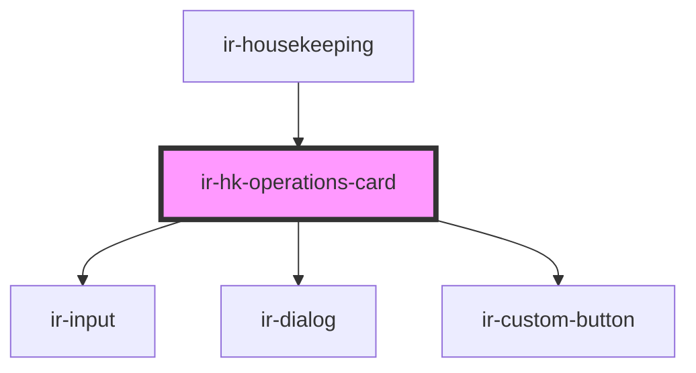

# ir-hk-operations-card

<!-- Auto Generated Below -->

## Properties

| Property      | Attribute | Description | Type         | Default |
| ------------- | --------- | ----------- | ------------ | ------- |
| `frequencies` | --        |             | `IEntries[]` | `[]`    |

## Events

| Event   | Description | Type                                                                                                 |
| ------- | ----------- | ---------------------------------------------------------------------------------------------------- |
| `toast` |             | `CustomEvent<ICustomToast & Partial<IToastWithButton> \| IDefaultToast & Partial<IToastWithButton>>` |

## Dependencies

### Used by

 - [ir-housekeeping](..)

### Depends on

- [ir-input](../../ui/ir-input)
- [ir-dialog](../../ui/ir-dialog)
- [ir-custom-button](../../ui/ir-custom-button)

### Graph

----------------------------------------------

*Built with [StencilJS](https://stenciljs.com/)*
