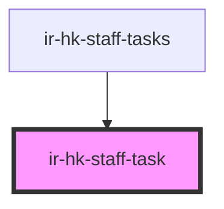

# ir-hk-staff-task

<!-- Auto Generated Below -->

## Properties

| Property | Attribute | Description | Type      | Default     |
| -------- | --------- | ----------- | --------- | ----------- |
| `future` | `future`  |             | `boolean` | `false`     |
| `task`   | --        |             | `Task`    | `undefined` |

## Events

| Event       | Description | Type                |
| ----------- | ----------- | ------------------- |
| `taskClick` |             | `CustomEvent<Task>` |

## Dependencies

### Used by

 - [ir-hk-staff-tasks](..)

### Graph

----------------------------------------------

*Built with [StencilJS](https://stenciljs.com/)*
