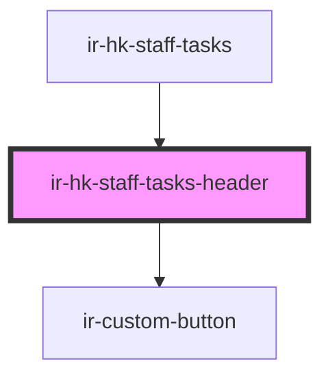

# ir-hk-staff-tasks-header

<!-- Auto Generated Below -->

## Properties

| Property      | Attribute  | Description | Type          | Default     |
| ------------- | ---------- | ----------- | ------------- | ----------- |
| `connectedHK` | --         |             | `ConnectedHK` | `undefined` |
| `language`    | `language` |             | `string`      | `'en'`      |

## Events

| Event             | Description | Type                  |
| ----------------- | ----------- | --------------------- |
| `languageChanged` |             | `CustomEvent<string>` |

## Dependencies

### Used by

 - [ir-hk-staff-tasks](..)

### Depends on

- [ir-custom-button](../../../ui/ir-custom-button)

### Graph

----------------------------------------------

*Built with [StencilJS](https://stenciljs.com/)*
