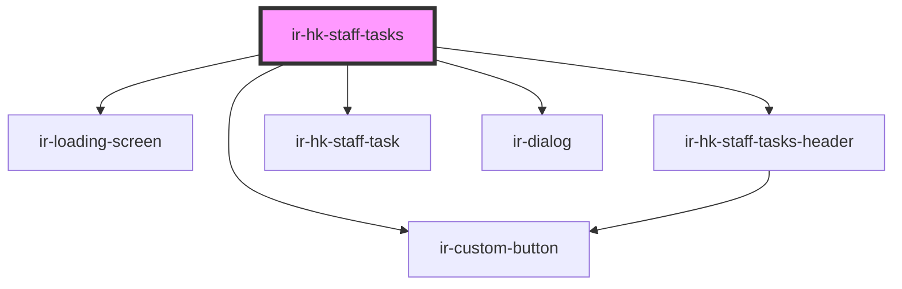

# ir-hk-staff-tasks

<!-- Auto Generated Below -->

## Properties

| Property   | Attribute  | Description | Type     | Default     |
| ---------- | ---------- | ----------- | -------- | ----------- |
| `baseurl`  | `baseurl`  |             | `string` | `undefined` |
| `language` | `language` |             | `string` | `'en'`      |
| `ticket`   | `ticket`   |             | `string` | `undefined` |

## Dependencies

### Depends on

- [ir-loading-screen](../../ir-loading-screen)
- [ir-hk-staff-tasks-header](ir-hk-staff-tasks-header)
- [ir-hk-staff-task](ir-hk-staff-task)
- [ir-dialog](../../ui/ir-dialog)
- [ir-custom-button](../../ui/ir-custom-button)

### Graph

----------------------------------------------

*Built with [StencilJS](https://stenciljs.com/)*
