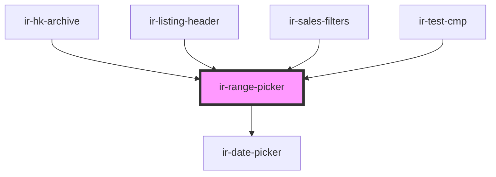

# ir-range-picker

<!-- Auto Generated Below -->

## Properties

| Property         | Attribute          | Description                                              | Type             | Default             |
| ---------------- | ------------------ | -------------------------------------------------------- | ---------------- | ------------------- |
| `allowNullDates` | `allow-null-dates` | Whether to all the emitted dates to be null.             | `boolean`        | `true`              |
| `fromDate`       | --                 | The start date of the range.                             | `Moment`         | `undefined`         |
| `maxDate`        | `max-date`         | The latest date that can be selected.                    | `Date \| string` | `moment().toDate()` |
| `minDate`        | `min-date`         | The earliest date that can be selected.                  | `Date \| string` | `undefined`         |
| `toDate`         | --                 | The end date of the range.                               | `Moment`         | `undefined`         |
| `withOverlay`    | `with-overlay`     | Whether to show the overlay before the date is selected. | `boolean`        | `true`              |

## Events

| Event              | Description | Type                                                 |
| ------------------ | ----------- | ---------------------------------------------------- |
| `dateRangeChanged` |             | `CustomEvent<{ fromDate: Moment; toDate: Moment; }>` |

## Dependencies

### Used by

 - [ir-hk-archive](..)
 - [ir-listing-header](../../../../ir-booking-listing/ir-listing-header)
 - [ir-sales-filters](../../../../ir-sales-by-country/ir-sales-filters)
 - [ir-test-cmp](../../../../ir-test-cmp)

### Depends on

- [ir-date-picker](../../../../ui/ir-date-picker)

### Graph

----------------------------------------------

*Built with [StencilJS](https://stenciljs.com/)*
