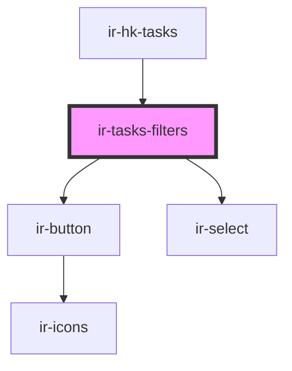

# ir-tasks-filters

<!-- Auto Generated Below -->

## Properties

| Property    | Attribute    | Description | Type      | Default     |
| ----------- | ------------ | ----------- | --------- | ----------- |
| `isLoading` | `is-loading` |             | `boolean` | `undefined` |

## Events

| Event          | Description | Type                                                                                                                                                                                                      |
| -------------- | ----------- | --------------------------------------------------------------------------------------------------------------------------------------------------------------------------------------------------------- |
| `applyFilters` |             | `CustomEvent<{ cleaning_periods: { code: string; }; housekeepers: { id: number; }[]; cleaning_frequencies: { code: string; }; dusty_units: { code: string; }; highlight_check_ins: { code: string; }; }>` |

## Dependencies

### Used by

 - [ir-hk-tasks](..)

### Depends on

- [ir-button](../../../ui/ir-button)
- [ir-select](../../../ui/ir-select)

### Graph

----------------------------------------------

*Built with [StencilJS](https://stenciljs.com/)*
