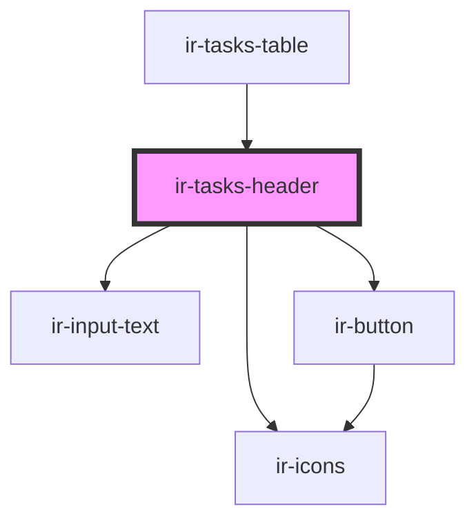

# ir-tasks-header

<!-- Auto Generated Below -->

## Events

| Event               | Description | Type                                                         |
| ------------------- | ----------- | ------------------------------------------------------------ |
| `headerButtonPress` |             | `CustomEvent<{ name: "cleaned" \| "export" \| "archive"; }>` |

## Dependencies

### Used by

 - [ir-tasks-table](../ir-tasks-table)

### Depends on

- [ir-input-text](../../../ui/ir-input-text)
- [ir-icons](../../../ui/ir-icons)
- [ir-button](../../../ui/ir-button)

### Graph

----------------------------------------------

*Built with [StencilJS](https://stenciljs.com/)*
