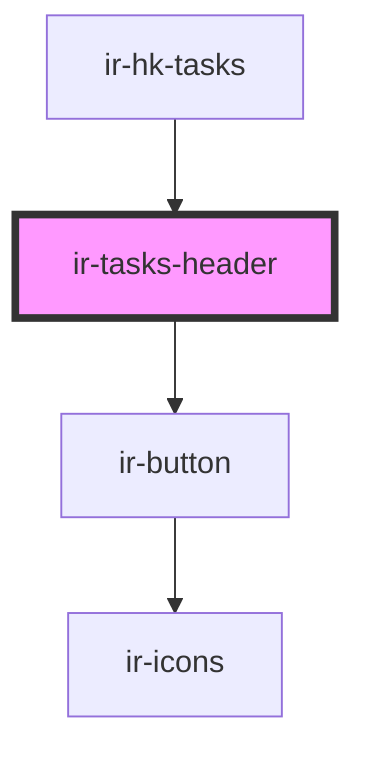

# ir-tasks-header

<!-- Auto Generated Below -->

## Properties

| Property           | Attribute            | Description | Type      | Default |
| ------------------ | -------------------- | ----------- | --------- | ------- |
| `isCleanedEnabled` | `is-cleaned-enabled` |             | `boolean` | `false` |

## Events

| Event               | Description | Type                                                         |
| ------------------- | ----------- | ------------------------------------------------------------ |
| `headerButtonPress` |             | `CustomEvent<{ name: "cleaned" \| "export" \| "archive"; }>` |

## Dependencies

### Used by

 - [ir-hk-tasks](..)

### Depends on

- [ir-button](../../../ui/ir-button)

### Graph

----------------------------------------------

*Built with [StencilJS](https://stenciljs.com/)*
