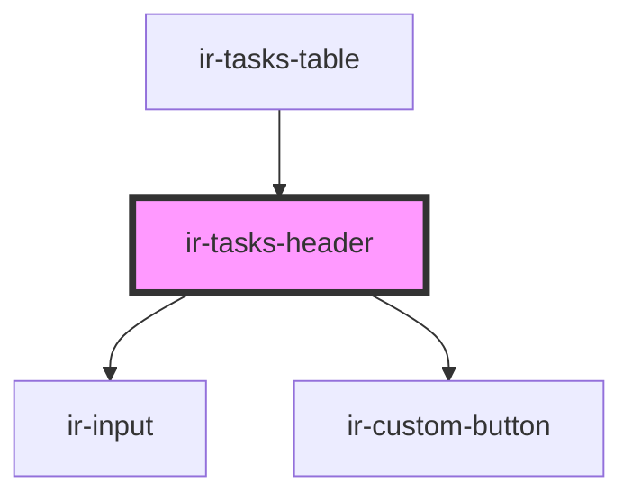

# ir-tasks-header

<!-- Auto Generated Below -->

## Events

| Event               | Description | Type                                                                            |
| ------------------- | ----------- | ------------------------------------------------------------------------------- |
| `headerButtonPress` |             | `CustomEvent<{ name: "export" \| "cleaned" \| "clean-inspect" \| "archive"; }>` |

## Dependencies

### Used by

 - [ir-tasks-table](../ir-tasks-table)

### Depends on

- [ir-input](../../../ui/ir-input)
- [ir-custom-button](../../../ui/ir-custom-button)

### Graph

```mermaid
graph TD;
  ir-tasks-header --> ir-input
  ir-tasks-header --> ir-custom-button
  ir-tasks-table --> ir-tasks-header
  style ir-tasks-header fill:#f9f,stroke:#333,stroke-width:4px
```

----------------------------------------------

*Built with [StencilJS](https://stenciljs.com/)*
