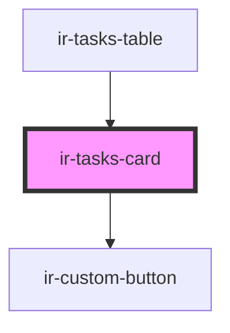

# ir-tasks-card

<!-- Auto Generated Below -->

## Properties

| Property      | Attribute      | Description | Type      | Default     |
| ------------- | -------------- | ----------- | --------- | ----------- |
| `isCheckable` | `is-checkable` |             | `boolean` | `undefined` |
| `isSkippable` | `is-skippable` |             | `boolean` | `undefined` |
| `task`        | --             |             | `Task`    | `undefined` |

## Events

| Event               | Description | Type                                                    |
| ------------------- | ----------- | ------------------------------------------------------- |
| `assignHousekeeper` |             | `CustomEvent<{ task: Task; hkm_id: number; }>`          |
| `cleanSelectedTask` |             | `CustomEvent<{ task: Task; status?: "001" \| "004"; }>` |
| `skipSelectedTask`  |             | `CustomEvent<Task>`                                     |

## Dependencies

### Used by

 - [ir-tasks-table](..)

### Depends on

- [ir-custom-button](../../../../ui/ir-custom-button)

### Graph

```mermaid
graph TD;
  ir-tasks-card --> ir-custom-button
  ir-tasks-table --> ir-tasks-card
  style ir-tasks-card fill:#f9f,stroke:#333,stroke-width:4px
```

----------------------------------------------

*Built with [StencilJS](https://stenciljs.com/)*
