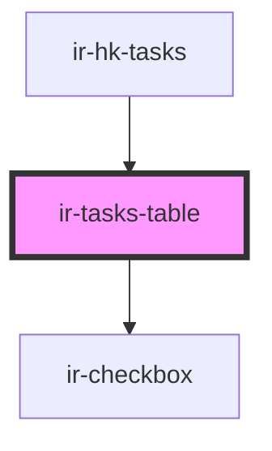

# ir-tasks-table

<!-- Auto Generated Below -->

## Properties

| Property | Attribute | Description | Type     | Default |
| -------- | --------- | ----------- | -------- | ------- |
| `tasks`  | --        |             | `Task[]` | `[]`    |

## Events

| Event                  | Description | Type                                                          |
| ---------------------- | ----------- | ------------------------------------------------------------- |
| `animateCleanedButton` |             | `CustomEvent<null>`                                           |
| `rowSelectChange`      |             | `CustomEvent<Task[]>`                                         |
| `sortingChanged`       |             | `CustomEvent<{ field: string; direction: "ASC" \| "DESC"; }>` |

## Dependencies

### Used by

 - [ir-hk-tasks](..)

### Depends on

- [ir-checkbox](../../../ui/ir-checkbox)

### Graph

----------------------------------------------

*Built with [StencilJS](https://stenciljs.com/)*
