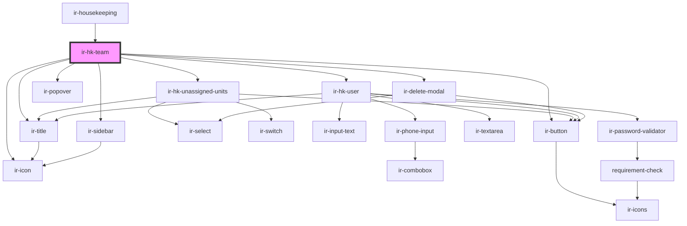

# ir-hk-team

<!-- Auto Generated Below -->

## Dependencies

### Used by

 - [ir-housekeeping](..)

### Depends on

- [ir-hk-unassigned-units](../ir-hk-unassigned-units)
- [ir-hk-user](../ir-hk-user)
- [ir-title](../../ir-title)
- [ir-icon](../../ui/ir-icon)
- [ir-popover](../../ui/ir-popover)
- [ir-button](../../ui/ir-button)
- [ir-sidebar](../../ui/ir-sidebar)
- [ir-delete-modal](../ir-delete-modal)

### Graph

----------------------------------------------

*Built with [StencilJS](https://stenciljs.com/)*
