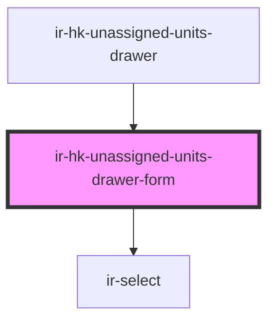

# ir-hk-unassigned-units-drawer-form

<!-- Auto Generated Below -->

## Properties

| Property | Attribute | Description | Type            | Default     |
| -------- | --------- | ----------- | --------------- | ----------- |
| `formId` | `form-id` |             | `string`        | `undefined` |
| `user`   | --        |             | `IHouseKeepers` | `null`      |

## Events

| Event          | Description | Type                |
| -------------- | ----------- | ------------------- |
| `closeSideBar` |             | `CustomEvent<null>` |
| `resetData`    |             | `CustomEvent<null>` |

## Dependencies

### Used by

 - [ir-hk-unassigned-units-drawer](..)

### Depends on

- [ir-select](../../../../ui/ir-select)

### Graph

----------------------------------------------

*Built with [StencilJS](https://stenciljs.com/)*
