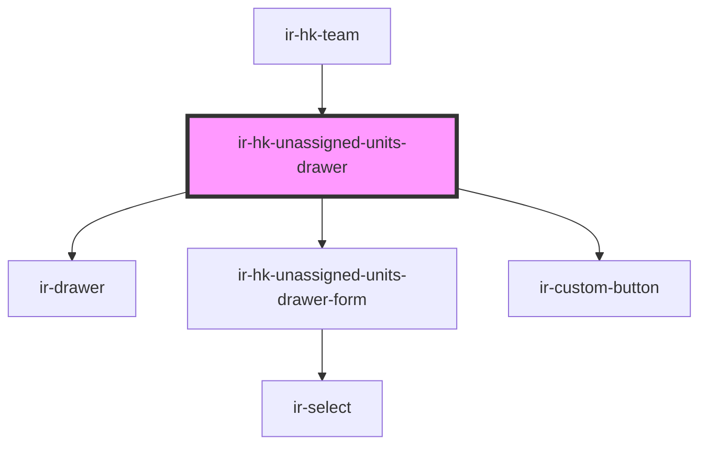

# ir-hk-unassigned-units-drawer

<!-- Auto Generated Below -->

## Properties

| Property | Attribute | Description | Type            | Default |
| -------- | --------- | ----------- | --------------- | ------- |
| `open`   | `open`    |             | `boolean`       | `false` |
| `user`   | --        |             | `IHouseKeepers` | `null`  |

## Events

| Event          | Description | Type                |
| -------------- | ----------- | ------------------- |
| `closeSideBar` |             | `CustomEvent<null>` |

## Dependencies

### Used by

 - [ir-hk-team](../../ir-hk-team)

### Depends on

- [ir-drawer](../../../ir-drawer)
- [ir-hk-unassigned-units-drawer-form](ir-hk-unassigned-units-drawer-form)
- [ir-custom-button](../../../ui/ir-custom-button)

### Graph

----------------------------------------------

*Built with [StencilJS](https://stenciljs.com/)*
