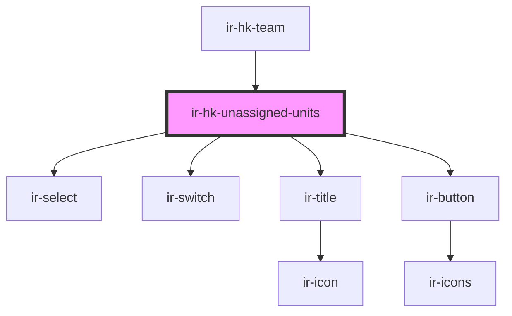

# ir-hk-unassigned-units

<!-- Auto Generated Below -->

## Properties

| Property | Attribute | Description | Type            | Default |
| -------- | --------- | ----------- | --------------- | ------- |
| `user`   | --        |             | `IHouseKeepers` | `null`  |

## Events

| Event          | Description | Type                |
| -------------- | ----------- | ------------------- |
| `closeSideBar` |             | `CustomEvent<null>` |
| `resetData`    |             | `CustomEvent<null>` |

## Dependencies

### Used by

 - [ir-hk-team](../ir-hk-team)

### Depends on

- [ir-select](../../ui/ir-select)
- [ir-switch](../../ui/ir-switch)
- [ir-title](../../ir-title)
- [ir-button](../../ui/ir-button)

### Graph

----------------------------------------------

*Built with [StencilJS](https://stenciljs.com/)*
