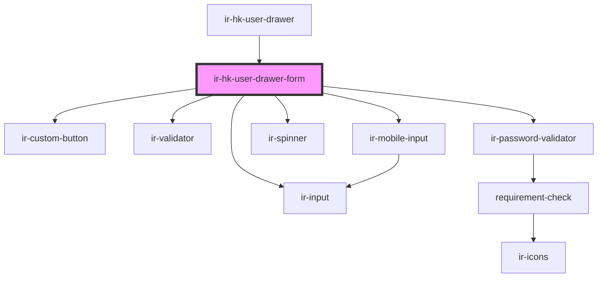

# ir-hk-user-drawer-form

<!-- Auto Generated Below -->

## Properties

| Property | Attribute | Description | Type                                                                                                                                         | Default     |
| -------- | --------- | ----------- | -------------------------------------------------------------------------------------------------------------------------------------------- | ----------- |
| `formId` | `form-id` |             | `string`                                                                                                                                     | `undefined` |
| `isEdit` | `is-edit` |             | `boolean`                                                                                                                                    | `false`     |
| `user`   | --        |             | `{ name: string; note: string; id: number; property_id: number; mobile: string; password: string; phone_prefix: string; username: string; }` | `null`      |

## Events

| Event            | Description | Type                   |
| ---------------- | ----------- | ---------------------- |
| `closeSideBar`   |             | `CustomEvent<null>`    |
| `loadingChanged` |             | `CustomEvent<boolean>` |
| `resetData`      |             | `CustomEvent<null>`    |

## Dependencies

### Used by

 - [ir-hk-user-drawer](..)

### Depends on

- [ir-custom-button](../../../../ui/ir-custom-button)
- [ir-validator](../../../../ui/ir-validator)
- [ir-input](../../../../ui/ir-input)
- [ir-password-validator](../../../../ir-password-validator)
- [ir-spinner](../../../../ui/ir-spinner)
- [ir-mobile-input](../../../../ui/ir-mobile-input)

### Graph

----------------------------------------------

*Built with [StencilJS](https://stenciljs.com/)*
