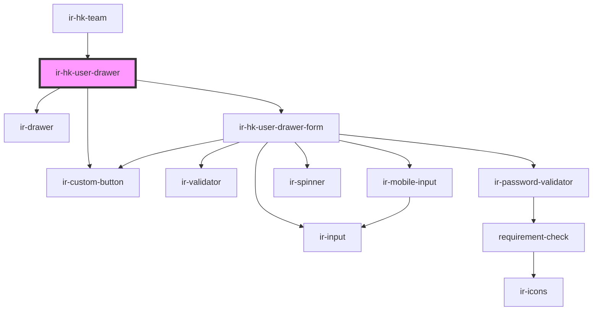

# ir-hk-user-drawer

<!-- Auto Generated Below -->

## Properties

| Property | Attribute | Description | Type                                                                                                                                         | Default |
| -------- | --------- | ----------- | -------------------------------------------------------------------------------------------------------------------------------------------- | ------- |
| `isEdit` | `is-edit` |             | `boolean`                                                                                                                                    | `false` |
| `open`   | `open`    |             | `boolean`                                                                                                                                    | `false` |
| `user`   | --        |             | `{ name: string; note: string; id: number; property_id: number; mobile: string; password: string; phone_prefix: string; username: string; }` | `null`  |

## Events

| Event          | Description | Type                |
| -------------- | ----------- | ------------------- |
| `closeSideBar` |             | `CustomEvent<null>` |

## Dependencies

### Used by

 - [ir-hk-team](../../ir-hk-team)

### Depends on

- [ir-drawer](../../../ir-drawer)
- [ir-hk-user-drawer-form](ir-hk-user-drawer-form)
- [ir-custom-button](../../../ui/ir-custom-button)

### Graph

----------------------------------------------

*Built with [StencilJS](https://stenciljs.com/)*
