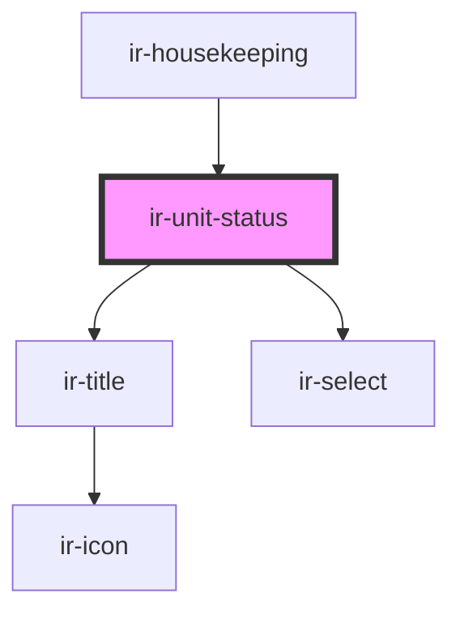

# ir-unit-status

<!-- Auto Generated Below -->

## Events

| Event       | Description | Type                |
| ----------- | ----------- | ------------------- |
| `resetData` |             | `CustomEvent<null>` |

## Dependencies

### Used by

 - [ir-housekeeping](..)

### Depends on

- [ir-title](../../ir-title)
- [ir-select](../../ui/ir-select)

### Graph

----------------------------------------------

*Built with [StencilJS](https://stenciljs.com/)*
