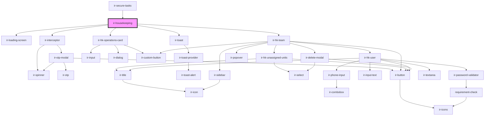

# ir-housekeeping

<!-- Auto Generated Below -->

## Properties

| Property     | Attribute    | Description | Type     | Default     |
| ------------ | ------------ | ----------- | -------- | ----------- |
| `baseUrl`    | `base-url`   |             | `string` | `undefined` |
| `language`   | `language`   |             | `string` | `''`        |
| `p`          | `p`          |             | `string` | `undefined` |
| `propertyid` | `propertyid` |             | `number` | `undefined` |
| `ticket`     | `ticket`     |             | `string` | `''`        |

## Events

| Event   | Description | Type                                                                                                 |
| ------- | ----------- | ---------------------------------------------------------------------------------------------------- |
| `toast` |             | `CustomEvent<ICustomToast & Partial<IToastWithButton> \| IDefaultToast & Partial<IToastWithButton>>` |

## Dependencies

### Used by

 - [ir-secure-tasks](../ir-secure-tasks)

### Depends on

- [ir-loading-screen](../ir-loading-screen)
- [ir-interceptor](../ir-interceptor)
- [ir-toast](../ui/ir-toast)
- [ir-hk-operations-card](ir-hk-operations-card)
- [ir-hk-team](ir-hk-team)

### Graph

```mermaid
graph TD;
  ir-housekeeping --> ir-loading-screen
  ir-housekeeping --> ir-interceptor
  ir-housekeeping --> ir-toast
  ir-housekeeping --> ir-hk-operations-card
  ir-housekeeping --> ir-hk-team
  ir-interceptor --> ir-spinner
  ir-interceptor --> ir-otp-modal
  ir-otp-modal --> ir-spinner
  ir-otp-modal --> ir-otp
  ir-otp-modal --> ir-button
  ir-button --> ir-icons
  ir-toast --> ir-toast-provider
  ir-toast-provider --> ir-toast-alert
  ir-hk-operations-card --> ir-input
  ir-hk-operations-card --> ir-dialog
  ir-hk-operations-card --> ir-custom-button
  ir-hk-team --> ir-hk-unassigned-units
  ir-hk-team --> ir-hk-user
  ir-hk-team --> ir-custom-button
  ir-hk-team --> ir-popover
  ir-hk-team --> ir-button
  ir-hk-team --> ir-sidebar
  ir-hk-team --> ir-delete-modal
  ir-hk-unassigned-units --> ir-select
  ir-hk-unassigned-units --> ir-title
  ir-hk-unassigned-units --> ir-button
  ir-title --> ir-icon
  ir-hk-user --> ir-title
  ir-hk-user --> ir-input-text
  ir-hk-user --> ir-phone-input
  ir-hk-user --> ir-textarea
  ir-hk-user --> ir-password-validator
  ir-hk-user --> ir-button
  ir-phone-input --> ir-combobox
  ir-password-validator --> requirement-check
  requirement-check --> ir-icons
  ir-sidebar --> ir-icon
  ir-delete-modal --> ir-button
  ir-delete-modal --> ir-select
  ir-secure-tasks --> ir-housekeeping
  style ir-housekeeping fill:#f9f,stroke:#333,stroke-width:4px
```

----------------------------------------------

*Built with [StencilJS](https://stenciljs.com/)*
