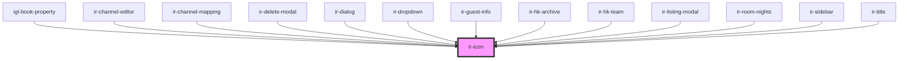

# ir-icon

<!-- Auto Generated Below -->

## Properties

| Property | Attribute | Description | Type     | Default      |
| -------- | --------- | ----------- | -------- | ------------ |
| `icon`   | `icon`    |             | `string` | `'ft-check'` |

## Events

| Event              | Description | Type               |
| ------------------ | ----------- | ------------------ |
| `iconClickHandler` |             | `CustomEvent<any>` |

## Dependencies

### Used by

 - [igl-book-property](../igloo-calendar/igl-book-property)
 - [ir-channel-editor](../ir-channel/ir-channel-editor)
 - [ir-channel-mapping](../ir-channel/ir-channel-mapping)
 - [ir-delete-modal](../ir-housekeeping/ir-delete-modal)
 - [ir-dialog](../ir-dialog)
 - [ir-dropdown](../ir-dropdown)
 - [ir-guest-info](../ir-guest-info)
 - [ir-hk-archive](../ir-housekeeping/ir-hk-tasks/ir-hk-archive)
 - [ir-hk-team](../ir-housekeeping/ir-hk-team)
 - [ir-listing-modal](../ir-booking-listing/ir-listing-modal)
 - [ir-room-nights](../igloo-calendar/ir-room-nights)
 - [ir-sidebar](../ir-sidebar)
 - [ir-title](../ir-title)

### Graph

----------------------------------------------

*Built with [StencilJS](https://stenciljs.com/)*
