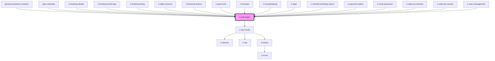

# ir-interceptor

<!-- Auto Generated Below -->

## Properties

| Property                 | Attribute | Description                                                               | Type       | Default                                                                                                   |
| ------------------------ | --------- | ------------------------------------------------------------------------- | ---------- | --------------------------------------------------------------------------------------------------------- |
| `handledEndpoints`       | --        | List of endpoint paths that should trigger loader logic and OTP handling. | `string[]` | `['/Get_Exposed_Calendar', '/ReAllocate_Exposed_Room', '/Get_Exposed_Bookings', '/UnBlock_Exposed_Unit']` |
| `suppressToastEndpoints` | --        | List of endpoints for which to suppress toast messages.                   | `string[]` | `[]`                                                                                                      |

## Events

| Event   | Description                                                              | Type                                                                                                 |
| ------- | ------------------------------------------------------------------------ | ---------------------------------------------------------------------------------------------------- |
| `toast` | Emits a toast notification (`type`, `title`, `description`, `position`). | `CustomEvent<ICustomToast & Partial<IToastWithButton> \| IDefaultToast & Partial<IToastWithButton>>` |

## Dependencies

### Used by

 - [igl-book-property-container](../igl-book-property-container)
 - [igloo-calendar](../igloo-calendar)
 - [ir-booking-details](../ir-booking-details)
 - [ir-booking-email-logs](../ir-booking-email-logs)
 - [ir-booking-listing](../ir-booking-listing)
 - [ir-daily-revenue](../ir-daily-revenue)
 - [ir-financial-actions](../ir-financial-actions)
 - [ir-guest-info](../ir-guest-info)
 - [ir-hk-tasks](../ir-housekeeping/ir-hk-tasks)
 - [ir-housekeeping](../ir-housekeeping)
 - [ir-login](../ir-login)
 - [ir-monthly-bookings-report](../ir-monthly-bookings-report)
 - [ir-payment-option](../ir-payment-option)
 - [ir-reset-password](../ir-reset-password)
 - [ir-sales-by-channel](../ir-sales-by-channel)
 - [ir-sales-by-country](../ir-sales-by-country)
 - [ir-user-management](../ir-user-management)

### Depends on

- [ir-otp-modal](../ir-otp-modal)

### Graph

----------------------------------------------

*Built with [StencilJS](https://stenciljs.com/)*
