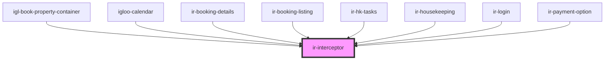

# ir-interceptor

<!-- Auto Generated Below -->

## Properties

| Property           | Attribute | Description | Type       | Default                                                                          |
| ------------------ | --------- | ----------- | ---------- | -------------------------------------------------------------------------------- |
| `handledEndpoints` | --        |             | `string[]` | `['/Get_Exposed_Calendar', '/ReAllocate_Exposed_Room', '/Get_Exposed_Bookings']` |
| `ticket`           | `ticket`  |             | `string`   | `undefined`                                                                      |

## Events

| Event   | Description | Type                                                                                                 |
| ------- | ----------- | ---------------------------------------------------------------------------------------------------- |
| `toast` |             | `CustomEvent<ICustomToast & Partial<IToastWithButton> \| IDefaultToast & Partial<IToastWithButton>>` |

## Dependencies

### Used by

 - [igl-book-property-container](../igl-book-property-container)
 - [igloo-calendar](../igloo-calendar)
 - [ir-booking-details](../ir-booking-details)
 - [ir-booking-listing](../ir-booking-listing)
 - [ir-hk-tasks](../ir-housekeeping/ir-hk-tasks)
 - [ir-housekeeping](../ir-housekeeping)
 - [ir-login](../ir-login)
 - [ir-payment-option](../ir-payment-option)

### Graph

----------------------------------------------

*Built with [StencilJS](https://stenciljs.com/)*
