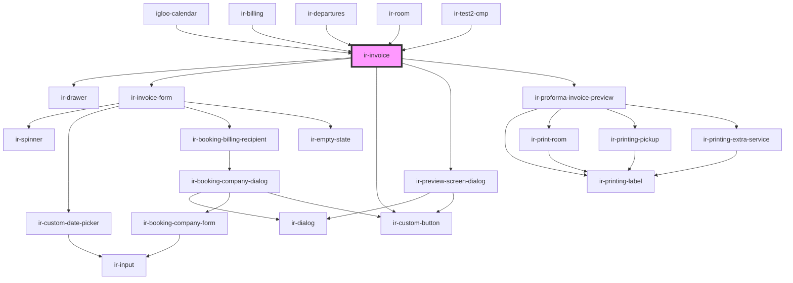

# ir-invoice

<!-- Auto Generated Below -->

## Properties

| Property         | Attribute         | Description                                                                                                                                                                                                          | Type                                                                                                                                                                                                                                                                                                                                                                                                                                                                                                                                                                                                                                                                                                                                                                                                                                                                                                                                                                                                                                                             | Default     |
| ---------------- | ----------------- | -------------------------------------------------------------------------------------------------------------------------------------------------------------------------------------------------------------------- | ---------------------------------------------------------------------------------------------------------------------------------------------------------------------------------------------------------------------------------------------------------------------------------------------------------------------------------------------------------------------------------------------------------------------------------------------------------------------------------------------------------------------------------------------------------------------------------------------------------------------------------------------------------------------------------------------------------------------------------------------------------------------------------------------------------------------------------------------------------------------------------------------------------------------------------------------------------------------------------------------------------------------------------------------------------------- | ----------- |
| `autoPrint`      | `auto-print`      | When `true`, automatically triggers `window.print()` after an invoice is created. Useful for setups where the invoice should immediately be sent to a printer.                                                       | `boolean`                                                                                                                                                                                                                                                                                                                                                                                                                                                                                                                                                                                                                                                                                                                                                                                                                                                                                                                                                                                                                                                        | `false`     |
| `booking`        | --                | The booking object for which the invoice is being generated. Should contain room, guest, and pricing information.                                                                                                    | `Booking`                                                                                                                                                                                                                                                                                                                                                                                                                                                                                                                                                                                                                                                                                                                                                                                                                                                                                                                                                                                                                                                        | `undefined` |
| `for`            | `for`             | Specifies what the invoice is for. - `"room"`: invoice for a specific room - `"booking"`: invoice for the entire booking                                                                                             | `"booking" \| "room"`                                                                                                                                                                                                                                                                                                                                                                                                                                                                                                                                                                                                                                                                                                                                                                                                                                                                                                                                                                                                                                            | `'booking'` |
| `invoiceInfo`    | --                | Additional invoice-related metadata used when creating or rendering the invoice.  This object can include payment details, discounts, tax information, or any context needed by the invoice form.                    | `{ invoiceable_items?: { key?: number; system_id?: any; amount?: number; currency?: { symbol?: string; id?: number; code?: string; }; type?: InvoiceableItemType; status?: any; booking_nbr?: string; invoice_nbr?: string; reason?: { code?: InvoiceableItemReasonCode; description?: string; }; is_invoiceable?: boolean; }[]; invoices?: { user?: string; system_id?: number; date?: string; currency?: { symbol?: string; id?: number; code?: string; }; status?: { code?: string; description?: any; }; booking_nbr?: string; target?: any; nbr?: string; remark?: string; billed_to_name?: any; billed_to_tax?: any; items?: { key?: number; system_id?: number; amount?: number; currency?: { symbol?: string; id?: number; code?: string; }; type?: string; status?: { code?: string; description?: any; }; description?: any; booking_nbr?: string; invoice_nbr?: string; is_invoiceable?: boolean; }[]; credit_note?: { user?: string; system_id?: string; date?: string; reason?: string; nbr?: string; }; pdf_url?: any; total_amount?: any; }[]; }` | `undefined` |
| `open`           | `open`            | Whether the invoice drawer is open.  This prop is mutable and reflected to the host element, allowing parent components to control visibility via markup or via the public `openDrawer()` / `closeDrawer()` methods. | `boolean`                                                                                                                                                                                                                                                                                                                                                                                                                                                                                                                                                                                                                                                                                                                                                                                                                                                                                                                                                                                                                                                        | `undefined` |
| `roomIdentifier` | `room-identifier` | The identifier of the room for which the invoice is being generated. Used when invoicing at room level instead of booking level.                                                                                     | `string`                                                                                                                                                                                                                                                                                                                                                                                                                                                                                                                                                                                                                                                                                                                                                                                                                                                                                                                                                                                                                                                         | `undefined` |

## Events

| Event          | Description                                                                                                                                  | Type                |
| -------------- | -------------------------------------------------------------------------------------------------------------------------------------------- | ------------------- |
| `invoiceClose` | Emitted when the invoice drawer is closed.  Fired when `closeDrawer()` is called, including when the underlying drawer emits `onDrawerHide`. | `CustomEvent<void>` |
| `invoiceOpen`  | Emitted when the invoice drawer is opened.  Fired when `openDrawer()` is called and the component transitions into the open state.           | `CustomEvent<void>` |

## Methods

### `closeDrawer() => Promise<void>`

Closes the invoice drawer.

This method sets the `open` property to `false`, hiding the drawer.
Parent components can call this to close the drawer programmatically,
and it is also used internally when the drawer emits `onDrawerHide`.

Also emits the `invoiceClose` event.

#### Returns

Type: `Promise<void>`

Resolves once the drawer state is updated.

### `openDrawer() => Promise<void>`

Opens the invoice drawer.

This method sets the `open` property to `true`, making the drawer visible.
It can be called programmatically by parent components.

Also emits the `invoiceOpen` event.

#### Returns

Type: `Promise<void>`

Resolves once the drawer state is updated.

## Dependencies

### Used by

 - [igloo-calendar](../igloo-calendar)
 - [ir-billing](../ir-billing)
 - [ir-departures](../ir-departures)
 - [ir-room](../ir-booking-details/ir-room)
 - [ir-test2-cmp](../ir-test-cmp)

### Depends on

- [ir-drawer](../ir-drawer)
- [ir-invoice-form](ir-invoice-form)
- [ir-custom-button](../ui/ir-custom-button)
- [ir-preview-screen-dialog](../ir-preview-screen-dialog)
- [ir-proforma-invoice-preview](../printing/ir-proforma-invoice-preview)

### Graph

----------------------------------------------

*Built with [StencilJS](https://stenciljs.com/)*
