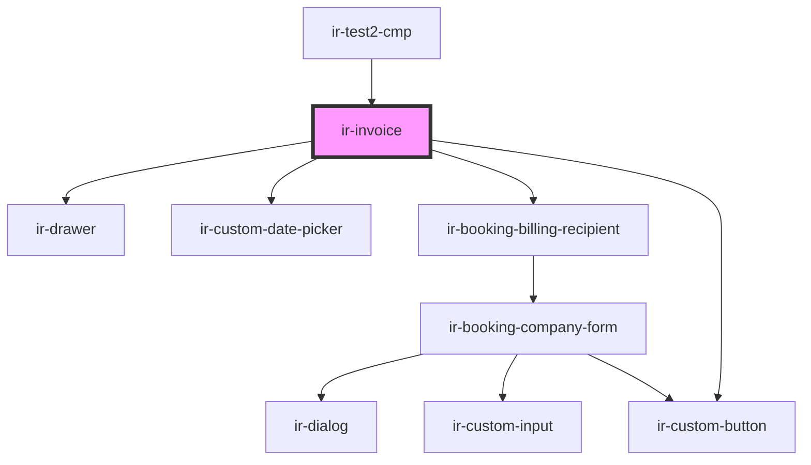

# ir-invoice

<!-- Auto Generated Below -->

## Properties

| Property         | Attribute         | Description                                                                                                                                                                                                          | Type                            | Default     |
| ---------------- | ----------------- | -------------------------------------------------------------------------------------------------------------------------------------------------------------------------------------------------------------------- | ------------------------------- | ----------- |
| `autoPrint`      | `auto-print`      | When `true`, automatically triggers `window.print()` after an invoice is created. Useful for setups where the invoice should immediately be sent to a printer.                                                       | `boolean`                       | `false`     |
| `booking`        | --                | The booking object for which the invoice is being generated. Should contain room, guest, and pricing information.                                                                                                    | `Booking`                       | `undefined` |
| `for`            | `for`             | Specifies what the invoice is for. - `"room"`: invoice for a specific room - `"booking"`: invoice for the entire booking                                                                                             | `"booking" \| "room"`           | `'booking'` |
| `mode`           | `mode`            | Determines what should happen after creating the invoice. - `"create"`: create an invoice normally - `"check_in-create"`: create an invoice as part of the check-in flow                                             | `"check_in-create" \| "create"` | `'create'`  |
| `open`           | `open`            | Whether the invoice drawer is open.  This prop is mutable and reflected to the host element, allowing parent components to control visibility via markup or via the public `openDrawer()` / `closeDrawer()` methods. | `boolean`                       | `undefined` |
| `roomIdentifier` | `room-identifier` | The identifier of the room for which the invoice is being generated. Used when invoicing at room level instead of booking level.                                                                                     | `string`                        | `undefined` |

## Events

| Event            | Description                                                                                                                                                                                                                                                                                                                                            | Type                                                                                                                                              |
| ---------------- | ------------------------------------------------------------------------------------------------------------------------------------------------------------------------------------------------------------------------------------------------------------------------------------------------------------------------------------------------------ | ------------------------------------------------------------------------------------------------------------------------------------------------- |
| `invoiceClose`   | Emitted when the invoice drawer is closed.  Fired when `closeDrawer()` is called, including when the underlying drawer emits `onDrawerHide`.                                                                                                                                                                                                           | `CustomEvent<void>`                                                                                                                               |
| `invoiceCreated` | Emitted when an invoice is created/confirmed.  The event `detail` contains: - `booking`: the booking associated with the invoice - `recipientId`: the selected billing recipient - `for`: whether the invoice is for `"room"` or `"booking"` - `roomIdentifier`: the room identifier when invoicing a specific room - `mode`: the current invoice mode | `CustomEvent<{ booking: Booking; recipientId: string; for: "room" \| "booking"; roomIdentifier?: string; mode: "create" \| "check_in-create"; }>` |
| `invoiceOpen`    | Emitted when the invoice drawer is opened.  Fired when `openDrawer()` is called and the component transitions into the open state.                                                                                                                                                                                                                     | `CustomEvent<void>`                                                                                                                               |

## Methods

### `closeDrawer() => Promise<void>`

Closes the invoice drawer.

This method sets the `open` property to `false`, hiding the drawer.
Parent components can call this to close the drawer programmatically,
and it is also used internally when the drawer emits `onDrawerHide`.

Also emits the `invoiceClose` event.

#### Returns

Type: `Promise<void>`

Resolves once the drawer state is updated.

### `openDrawer() => Promise<void>`

Opens the invoice drawer.

This method sets the `open` property to `true`, making the drawer visible.
It can be called programmatically by parent components.

Also emits the `invoiceOpen` event.

#### Returns

Type: `Promise<void>`

Resolves once the drawer state is updated.

## Dependencies

### Used by

 - [ir-test2-cmp](../ir-test-cmp)

### Depends on

- [ir-drawer](../ir-drawer)
- [ir-custom-date-picker](../ir-custom-date-picker)
- [ir-booking-billing-recipient](../ir-booking-billing-recipient)
- [ir-custom-button](../ui/ir-custom-button)

### Graph

----------------------------------------------

*Built with [StencilJS](https://stenciljs.com/)*
