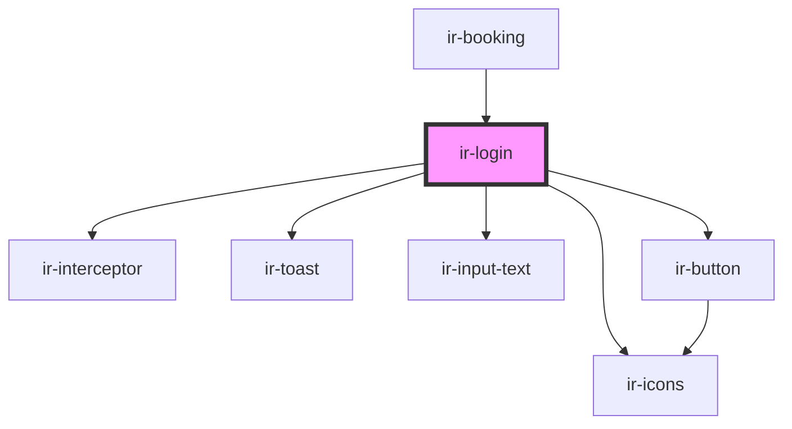

# ir-login

<!-- Auto Generated Below -->

## Events

| Event        | Description | Type                                                           |
| ------------ | ----------- | -------------------------------------------------------------- |
| `authFinish` |             | `CustomEvent<{ token: string; code: "error" \| "succsess"; }>` |

## Dependencies

### Used by

 - [ir-booking](../ir-booking)

### Depends on

- [ir-interceptor](../ir-interceptor)
- [ir-toast](../ir-toast)
- [ir-input-text](../ir-input-text)
- [ir-icons](../ui/ir-icons)
- [ir-button](../ir-button)

### Graph

----------------------------------------------

*Built with [StencilJS](https://stenciljs.com/)*
