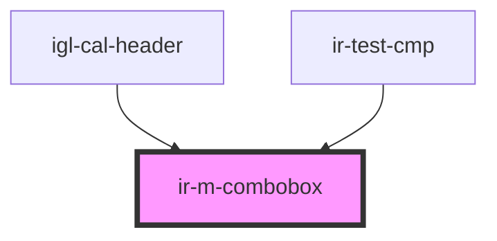

# ir-m-combobox

<!-- Auto Generated Below -->

## Properties

| Property        | Attribute        | Description                                                                                                                                                                                                                                         | Type                     | Default     |
| --------------- | ---------------- | --------------------------------------------------------------------------------------------------------------------------------------------------------------------------------------------------------------------------------------------------- | ------------------------ | ----------- |
| `dataMode`      | `data-mode`      | Determines how the options are loaded into the component. - 'static': Uses the options passed through the `options` prop or the default internal list. - 'external': Emits search events for external handling, options updated via `options` prop. | `"external" \| "static"` | `'static'`  |
| `debounceDelay` | `debounce-delay` | Debounce delay in milliseconds for search events when using external data mode.                                                                                                                                                                     | `number`                 | `300`       |
| `loading`       | `loading`        | Whether to show loading state                                                                                                                                                                                                                       | `boolean`                | `false`     |
| `options`       | --               | List of available options for the combobox when using static data mode. If empty, falls back to a default internal option list.                                                                                                                     | `ComboboxOption[]`       | `[]`        |
| `placeholder`   | `placeholder`    | Placeholder text displayed in the input when no option is selected.                                                                                                                                                                                 | `string`                 | `undefined` |
| `useSlot`       | `use-slot`       | Whether to use slot content for custom dropdown rendering                                                                                                                                                                                           | `boolean`                | `false`     |

## Events

| Event          | Description                                                                                                               | Type                          |
| -------------- | ------------------------------------------------------------------------------------------------------------------------- | ----------------------------- |
| `optionChange` | Emitted when a user selects an option from the combobox. The event payload contains the selected `ComboboxOption` object. | `CustomEvent<ComboboxOption>` |
| `searchQuery`  | Emitted when the user types in the input field (debounced). Used for external data fetching in 'external' data mode.      | `CustomEvent<string>`         |

## Methods

### `selectOptionFromSlot(option: ComboboxOption) => Promise<void>`

Public method to select an option from external slot content

#### Parameters

| Name     | Type             | Description |
| -------- | ---------------- | ----------- |
| `option` | `ComboboxOption` |             |

#### Returns

Type: `Promise<void>`

## Dependencies

### Used by

 - [igl-cal-header](../igloo-calendar/igl-cal-header)
 - [ir-test-cmp](../ir-test-cmp)

### Graph

----------------------------------------------

*Built with [StencilJS](https://stenciljs.com/)*
