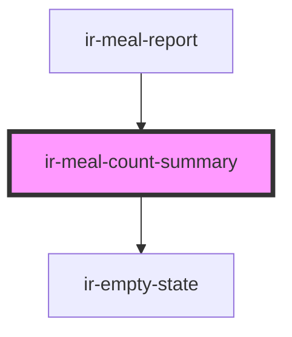

# ir-meal-count-summary

<!-- Auto Generated Below -->

## Properties

| Property           | Attribute | Description | Type                    | Default |
| ------------------ | --------- | ----------- | ----------------------- | ------- |
| `mealCountSummary` | --        |             | `MealCountDaySummary[]` | `[]`    |

## Dependencies

### Used by

 - [ir-meal-report](..)

### Depends on

- [ir-empty-state](../../ir-empty-state)

### Graph

----------------------------------------------

*Built with [StencilJS](https://stenciljs.com/)*
