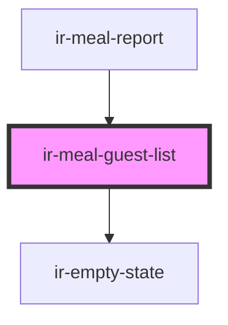

# ir-meal-guest-list

<!-- Auto Generated Below -->

## Properties

| Property    | Attribute | Description | Type               | Default |
| ----------- | --------- | ----------- | ------------------ | ------- |
| `guestList` | --        |             | `MealGuestEntry[]` | `[]`    |

## Dependencies

### Used by

 - [ir-meal-report](..)

### Depends on

- [ir-empty-state](../../ir-empty-state)

### Graph

----------------------------------------------

*Built with [StencilJS](https://stenciljs.com/)*
