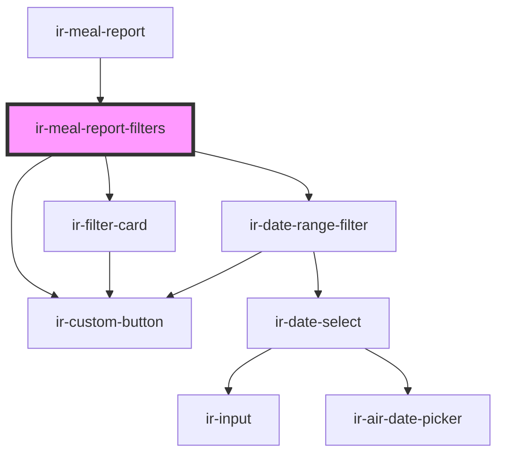

# ir-meal-report-filters

<!-- Auto Generated Below -->

## Properties

| Property       | Attribute     | Description | Type                                                    | Default        |
| -------------- | ------------- | ----------- | ------------------------------------------------------- | -------------- |
| `fromDate`     | `from-date`   |             | `string`                                                | `undefined`    |
| `isLoading`    | `is-loading`  |             | `boolean`                                               | `false`        |
| `lcz`          | `lcz`         |             | `any`                                                   | `{}`           |
| `mealType`     | `meal-type`   |             | `string`                                                | `null`         |
| `reportType`   | `report-type` |             | `"GUEST_LIST" \| "MEAL_COUNT"`                          | `'GUEST_LIST'` |
| `setupEntries` | --            |             | `{ meal_type: IEntries[]; hb_preference: IEntries[]; }` | `undefined`    |
| `toDate`       | `to-date`     |             | `string`                                                | `undefined`    |

## Events

| Event              | Description | Type                                         |
| ------------------ | ----------- | -------------------------------------------- |
| `dateChange`       |             | `CustomEvent<{ from: string; to: string; }>` |
| `filterApply`      |             | `CustomEvent<void>`                          |
| `filterReset`      |             | `CustomEvent<void>`                          |
| `mealTypeChange`   |             | `CustomEvent<string>`                        |
| `presetDate`       |             | `CustomEvent<"today" \| "tomorrow">`         |
| `reportTypeChange` |             | `CustomEvent<"GUEST_LIST" \| "MEAL_COUNT">`  |

## Dependencies

### Used by

 - [ir-meal-report](..)

### Depends on

- [ir-filter-card](../../ir-filter-card)
- [ir-date-range-filter](../../ui/ir-date-range-filter)
- [ir-custom-button](../../ui/ir-custom-button)

### Graph

----------------------------------------------

*Built with [StencilJS](https://stenciljs.com/)*
