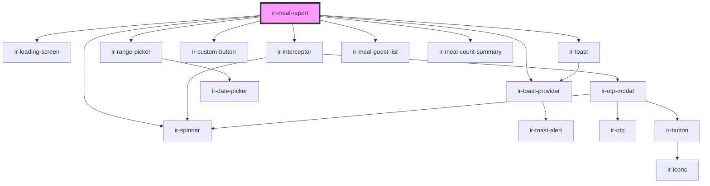

# ir-meal-report

<!-- Auto Generated Below -->

## Properties

| Property     | Attribute    | Description | Type     | Default     |
| ------------ | ------------ | ----------- | -------- | ----------- |
| `baseurl`    | `baseurl`    |             | `string` | `undefined` |
| `language`   | `language`   |             | `string` | `'en'`      |
| `propertyid` | `propertyid` |             | `number` | `undefined` |
| `ticket`     | `ticket`     |             | `string` | `undefined` |

## Dependencies

### Depends on

- [ir-loading-screen](../ir-loading-screen)
- [ir-toast](../ui/ir-toast)
- [ir-interceptor](../ir-interceptor)
- [ir-custom-button](../ui/ir-custom-button)
- [ir-range-picker](../ir-housekeeping/ir-hk-tasks/ir-hk-archive/ir-range-picker)
- [ir-spinner](../ui/ir-spinner)
- [ir-meal-guest-list](.)
- [ir-meal-count-summary](.)
- [ir-toast-provider](../ir-toast-provider)

### Graph

----------------------------------------------

*Built with [StencilJS](https://stenciljs.com/)*
